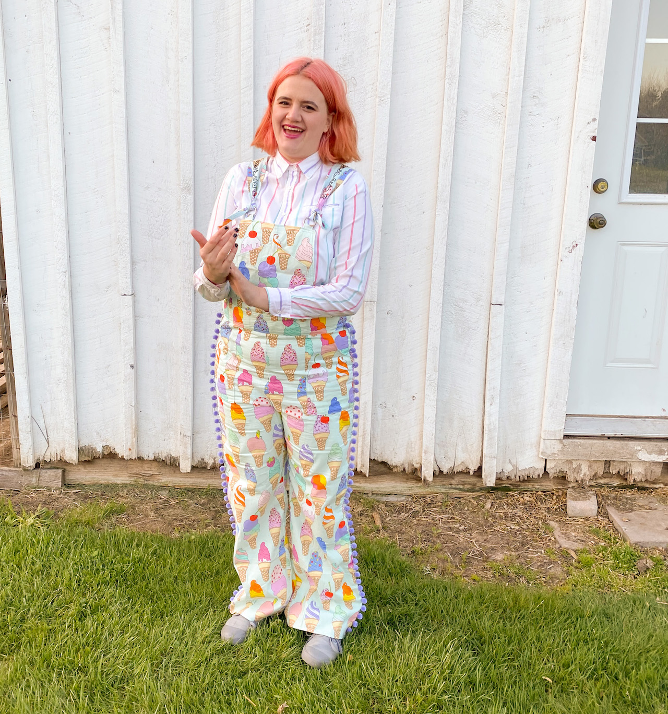

<h1>about me (left)</h1>

 
&emsp;I'm a PhD student at Tufts University studying mathematics interested in applied math, more specifically scientific computing and numerical linear algebra. I received a BS in applied and computational math from Brigham Young University, where I also minored in gender studies.   &emsp;As an undergraduate I did research with Dr. Tyler Jarvis about Rootfinding for systems of multivariate equations—with a numerical analysis flavor.   &emsp;When I'm not doing math, I love to read books and sew. I have the best cat to ever exist, Moose, and I live to dote on him. I also love things in nature like wildflowers, frogs, bats, and snakes.
 
