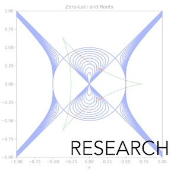
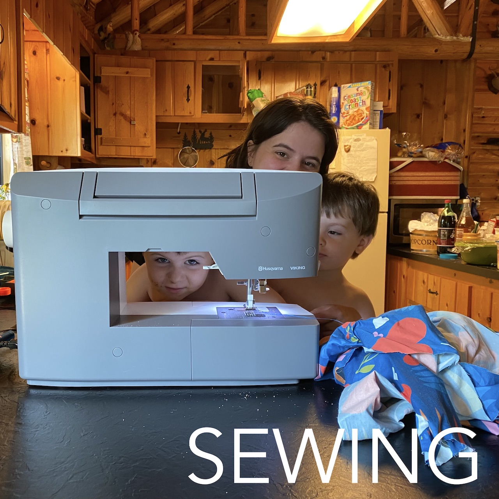
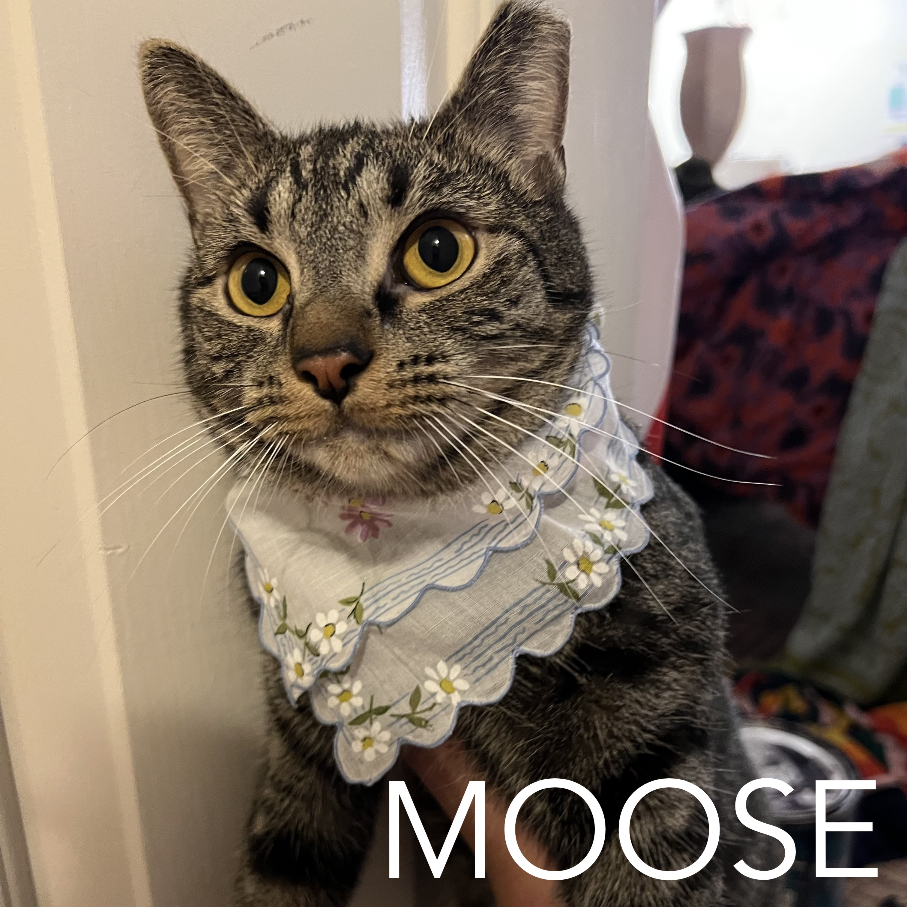

  

      <ul class="nav">
          <li><a href="{{ BASE_PATH }}/wall_cv.pdf">cv</a></li>
          <li><a href="https://github.com/katejeanw">github</a></li>
          <li><a href="https://www.instagram.com/kate.sews/">sewing</a></li>
          <li><a href="https://twitter.com/katejeanw">twitter</a></li>
      </ul>
  

<table class="wide">
<tr>
  <td class="left">
    
  </td>
  <td class="right">
    
  </td>
</tr>
<tr>
  <td class="left">
    
  </td>
  <td class="right">
    
  </td>
</tr>
<tr>
  <td class="left">
    
  </td>
  <td class="right">
    
  </td>
</tr>
</table>

  

      <ul class="nav">
          <li><a href="morefigs.html">more figures</a></li>
      </ul>
  

