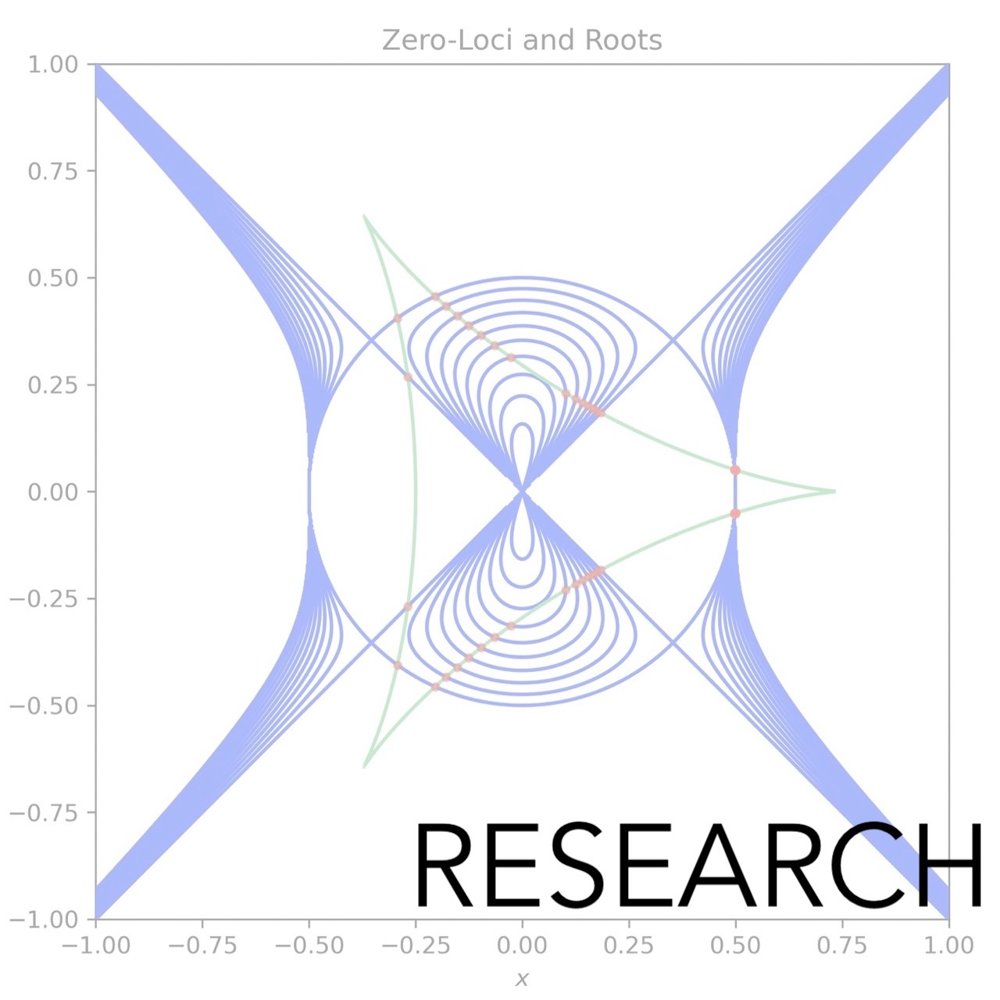

  

    
    
    
    
    
    
  

  

    
    
    
    
    
    
  

  

    
    
    
    
    
    
  

  

    
    
    
    
    
    
  

<section class="fotogrid">
  

    

      

        
      

      

        
      

      

        
      

    

    

      

        
      

      

        
      

      

        
      

    

  

</section>

<section class="fotogrid">
  

    

      

        
        <h4>about</h4>
      

      

        
        <h4>gender</h4>
      

      

        
        <h4>Moose</h4>
      

    

    

      

        
        <h4>research</h4>
      

      

        
        <h4>sewing</h4>
      

      

        
        <h4>misc</h4>
      

    

  

</section>
